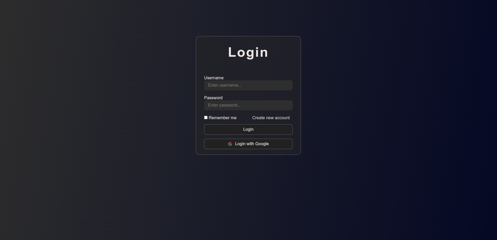
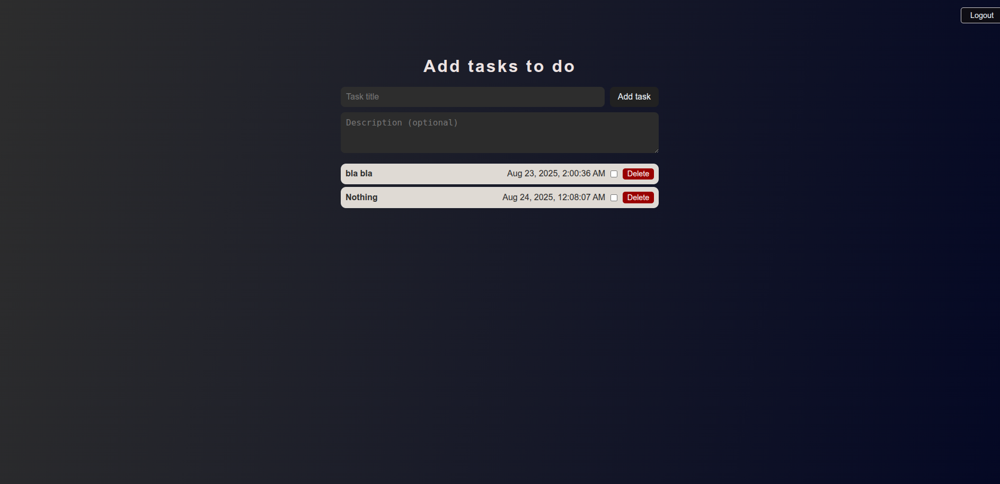

# 🚀 MyProject (ToDo App with Google OAuth)

A simple yet production-ready **Single Page Application (SPA)** built with:
- **Frontend:** Vanilla JS + AJAX
- **Backend:** Django + PostgreSQL
- **Auth:** JWT + Google OAuth2
- **Infra:** (Docker / Netlify / Render)

---

## ✨ Features
- User registration & login with JWT
- Google OAuth login (no DRF, direct SPA + CORS flow)
- Create, read, update, and delete tasks
- Fully responsive UI
- Logout & token refresh system

---

## 📸 Screenshots

> UI preview of the app





---

## ⚙️ Installation

Check the detailed steps here:  
👉 [INSTALLATIONS.md](docs/INSTALLATIONS.md)

---

## 🏗️ Architecture

How the app is structured & how components talk to each other:  
👉 [ARCHITECTURE.md](docs/ARCHITECTURE.md)

---

## 🧪 Tests

```bash
pytest

```

----------

## 🐳 Docker (Optional)

```bash
docker-compose up --build

```

----------

## 🚀 Deployment

-   **Frontend:** Netlify 
    
-   **Backend:** Render / Railway (Django + Postgres)
    
-   **Database:** PostgreSQL (Render / Railway managed service)
    

----------

## 📄 License

MIT License

